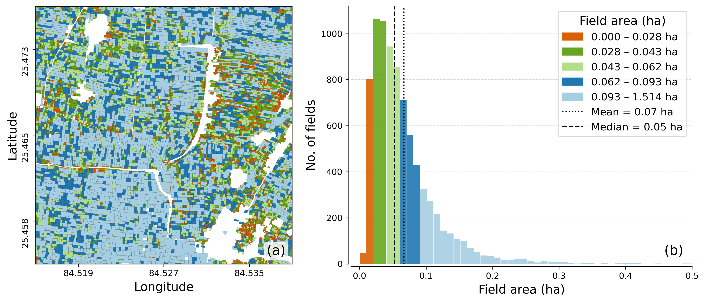

# field-boundary-zero-shot

Code and modified SkySat satellite imagery accompanying the journal article [*"Zero-shot inference strategies for smallholder (<0.1 ha) agriculture field delineation with the Segment Anything foundation model"*](https://doi.org/10.1016/j.srs.2026.100425) (Tripathy et al., 2026, *Science of Remote Sensing*).

The paper explores zero-shot inference strategies for the Segment Anything Model (SAM) for mapping smallholder agricultural field boundaries. Using 2 m SkySat imagery pansharpened to 0.8 m over Bihar, India, SAM identifies 57% of over 8000 manually digitized reference fields with a mean IoU of 0.73, without any fine-tuning. While the case study focuses on smallholder agriculture, the strategies isolated here, including model checkpoint, input tile size, multi-temporal fusion, and edge enhancement, generalize more broadly to other foundation models and remote sensing applications. The repository contains the post-processing and evaluation pipeline that converts raw SAM masks into vector field boundaries.



*Field sizes in our study area (mean 0.07 ha, median 0.05 ha) — substantially smaller than the parcels most prior studies retain after filtering.*

## What this repo contains

This repository contains the modified SkySat satellite imagery used in the study under [`data/`](data/), along with the post-processing and evaluation pipeline under [`scripts/`](scripts/). The pipeline is organised as five sequential Jupyter notebooks that take raw SAM masks through hierarchical merging across checkpoints, tile sizes, acquisition dates, and image variants, plus shared geometry utilities and the plotting code used for the manuscript figures. See [`scripts/README.md`](scripts/README.md) for the workflow table, dependencies, and a step-by-step description of each notebook, and [`data/README.md`](data/README.md) for details on the data files.

## Citation

If you use this code or build on the analysis, please cite the article:

> Tripathy, P., Baylis, K., Wu, K., Watson, J., & Jiang, R. (2026). Zero-shot inference strategies for smallholder (<0.1 ha) agriculture field delineation with the Segment Anything foundation model. *Science of Remote Sensing*, 100425. <https://doi.org/10.1016/j.srs.2026.100425>

### BibTeX

```bibtex
@article{tripathy2026zeroshot,
  author  = {Tripathy, Pratyush and Baylis, Kathy and Wu, Kyle and Watson, Jyles and Jiang, Ruizhe},
  title   = {Zero-shot inference strategies for smallholder ({$<$}0.1~ha) agriculture field delineation with the {Segment} {Anything} foundation model},
  journal = {Science of Remote Sensing},
  year    = {2026},
  pages   = {100425},
  doi     = {10.1016/j.srs.2026.100425},
  url     = {https://doi.org/10.1016/j.srs.2026.100425}
}
```

## License

Released under the [MIT License](LICENSE).

## Contact

Pratyush Tripathy — <ptripathy@ucsb.edu>  
Department of Geography  
University of California, Santa Barbara

## Funding

This work was supported by the Benioff Scholars Program in Applied Environmental Science scholarship and the Schmidt Family Foundation Research Accelerator award.
